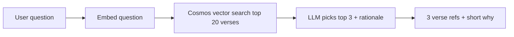

# Gita Lectures Feature — Implementation Prompt

Use this prompt (or adapt the relevant sections) when starting a new thread to
implement the Gita Lectures feature in Expert Answers — Vedanta.

---

## Short context for future threads

Expert Answers is a product that answers user questions by returning
trustworthy, timestamped segments from expert YouTube Q&A videos rather than
generic generated summaries. This deployment is the Vedanta / Swami
Sarvapriyananda experience. The backend is a FastAPI service backed by Azure
Cosmos DB for questions, topics, embeddings, and queue/upvotes, with
vector/topic/entity search plus OpenAI-assisted matching/filtering. The
frontend is a React app with Search, Explore by Topic, and **Gita** tabs, plus an optional
Debug tab behind `REACT_APP_ENABLE_DEBUG=true`. Primary retrieval uses the
curated Q&A database via `GET /api/answers/v1`. Do not describe historical
YouTube-search behavior, multi-expert comparison, or automatic transcript
parsing as shipped unless implementation is confirmed.

## What we're building

A third top-level tab called **Gita** (alongside Search and Explore) that lets
users browse Swami Sarvapriyananda's Bhagavad Gita lecture series by chapter
and verse. Clicking a verse plays the video that covers it. Users also see
verse text (Sanskrit + English) and, in later phases, lectures by other swamis
on the same verse.

This feature is **parallel to** the existing Q&A system, not a replacement.
The `/api/answers/v1` endpoint does not change. The core "ask anything" Q&A
flow remains the primary product surface.

## Key architectural insight

Unlike arbitrary YouTube lectures, Swamiji's Gita series is structured: one
video typically covers one verse or a small contiguous range (e.g., "Chapter
15, Verses 1-4"). This means **verse → video** is the right primary mapping,
not verse → timestamp-within-video. Start-time offsets inside multi-verse
videos are a Phase 2 concern, not Phase 1.

Source playlist: `PLDqahtm2vA72IzPW1nuJohTvoTGCJUKGR` on the Vedanta Society
of New York channel. Currently ~178 episodes, covering through Chapter 15 as
of Jul 2026.


## Phasing

**Phase 1 — shipped (Jul 2026).** Gita tab is live on Azure Static Web Apps.
Static JSON in `public/data/gita-map.json`; no backend or Cosmos changes.
Verse detail pages embed YouTube lectures inline. Chapters 1–14 fully mapped;
chapter 15 partial (9/20); chapters 16–18 unmapped (series still in progress).
Unmapped verses appear greyed out with "Coming soon".

**Phase 1.5a — keyword search (shipped Jul 2026).** Client-side search on Gita
landing. Build script adds `keywords[]` and `searchText` per verse in
`gita-map.json`. `GitaSearch` component filters locally — no backend.

**Phase 1.5b — question → verses (after 1.5a).** User asks a natural-language
question; return the 3 most relevant verses. Backend endpoint using the same
*spirit* as main Q&A hybrid search, but simplified for a tiny fixed corpus
(~559 verses today, 700 at full coverage). Pipeline: **vector search top ~20 →
LLM picks top 3**. Do not replicate full Q&A hybrid (vector + topic/entity +
LLM) — verses have no topic tags and the corpus is too small to need it.

**Phase 2 — timestamps within multi-verse videos.** Only for the ~20% of
videos that cover more than one verse. Pull YouTube auto-captions, prompt an
LLM with the known verse list for that video and ask where each verse begins.
Swamiji announces each verse explicitly, so recall is high. Store
`start_seconds` per (verse, video) pair. Update frontend to pass `?start=` to
the YouTube embed. Human-review a sample before shipping.

**Phase 3 — other swamis.** Ingest Gita playlists from 2–3 additional vetted
swamis (candidates: Swami Tadatmananda, Swami Paramarthananda, Swami
Chinmayananda archives, Swami Mukundananda). Same ingestion pattern, possibly
messier title parsing. Add a `speaker` dimension to the schema. Frontend adds
"Other teachers on this verse" section below the primary lecture, with each
swami's tradition clearly labeled.

**Phase 4 — generalize the transcript+LLM pipeline to the broader Q&A corpus.**
Gita lectures are the easiest case; if the pipeline works here, it extends to
the v2 ingestion roadmap item.


## Frontend (Phase 1)

**Status:** Implemented. Top-level tab **Gita**, alongside Search and Explore.
Uses `react-router-dom`. Data loaded once via `fetch('/data/gita-map.json')`
in `GitaDataProvider` (`src/context/GitaDataContext.js`).

Route structure:

- `/gita` — landing: 18 chapters, each with verse count and chapter title.
- `/gita/:chapter` — chapter view: verse grid (numbered tiles, chapter title, brief overview).
- `/gita/:chapter/:verse` — verse detail: Sanskrit, transliteration, English, YouTube embed.

URLs must be linkable/shareable — people will send "check out 2.47" links.

**Design tone.** Editorial, contemplative, serif-heavy. Warm off-white paper
tones, deep crimson or saffron as single accent color. Devanagari rendered
large and centered, treated with reverence (not as a data field). Generous
whitespace. Avoid dashboard/SaaS aesthetics.

Components: `src/components/gita/GitaLanding.js`, `GitaChapter.js`,
`GitaVerse.js`, `GitaRoutes.js`, `Gita.css`.

## Data architecture (Phase 1)

**Runtime source of truth:** committed static JSON — not Cosmos DB or Redis.
Gita data is read-only, versioned, and updated only when the playlist grows.

| Data | Source | Notes |
|------|--------|-------|
| Verse → video | CodexProjects `swami-sarvapriyananda-gita-map.json` | Canonical mapping |
| English meaning | Same file (`verseMap[].translation`) | Swami Swarupananda (1909) |
| Sanskrit + transliteration | CodexProjects `gita-verse-cache.json` | Build-time only; do not ship the 28MB cache |
| Runtime bundle | `public/data/gita-map.json` | ~700 KB; generated by `npm run build:gita-data` |

When multiple lectures map to one verse, the build script prefers a dedicated
single-verse lecture over a multi-verse range lecture (e.g. 2.47 → lecture 17,
not the 45–47 range video).

Regenerate after playlist or mapping changes:

```bash
npm run build:gita-data
# commit public/data/gita-map.json, push to main
```

## Deployment notes

**Hosting:** Azure Static Web Apps (GitHub Actions on push to `main`).
SPA fallback in `staticwebapp.config.json` supports `/gita/*` routes.

**YouTube embed Error 153 (fixed Jul 2026).** Embeds worked on localhost but
failed in production with "Error 153: Video player configuration error".
Direct "Open on YouTube" links still worked.

**Cause:** Azure Static Web Apps sets a default `Referrer-Policy: same-origin`
response header. That prevents the browser from sending a `Referer` header to
YouTube on cross-origin iframe requests. YouTube now requires a valid Referer
for embeds. Local CRA dev server does not set this header, so embeds worked
locally.

**Fix (two places — both required in production):**

1. `staticwebapp.config.json` — override Azure's default:
   ```json
   "globalHeaders": {
     "Referrer-Policy": "strict-origin-when-cross-origin"
   }
   ```
2. `GitaVerse.js` iframe — add `referrerPolicy="strict-origin-when-cross-origin"`

If embeds break again after deploy, hard-refresh or clear site cache; Azure
can briefly serve cached responses with old headers.

**CI checkout failure (fixed Jul 2026).** Accidentally committing a Claude
worktree gitlink (`.claude/worktrees/...`) without a `.gitmodules` entry caused
`actions/checkout` to fail when `submodules: true`. Fix: remove the gitlink,
add `.claude/` to `.gitignore`, set `submodules: false` in the workflow.

## Search (Phase 1.5 — agreed Jul 2026)

Two search modes, shipped in order. Browse (Phase 1) stays unchanged.

### Why this order

| Step | Mode | Where it runs | Why first |
|------|------|---------------|-----------|
| **1.5a** | Keyword search | Frontend only (static JSON) | Extends Phase 1 pattern; instant; no backend work |
| **1.5b** | Question → verses | Backend (Cosmos + OpenAI) | Needs embeddings + LLM; mirrors main Q&A quality bar |

**Not recommended for v1:** full Q&A hybrid (vector + topic/entity + LLM).
Verses do not have extracted topic/entity tags today, and ~559 items is small
enough that vector + LLM rerank is sufficient.

**Not recommended for 1.5a:** putting keywords only in Cosmos. Keywords belong
in `gita-map.json` for client search; Cosmos is for verse embeddings in 1.5b.

---

### Phase 1.5a — Keyword search (shipped)

**UX:** Search box on Gita landing. User types keywords (e.g. `karma`,
`detachment`, `2.47`). Results list matching verses with chapter.verse, English
snippet, link to verse detail.

**Implementation:**

- `scripts/build-gita-data.js` — adds `keywords[]` and `searchText` per verse
- `src/utils/gitaSearch.js` — client-side ranking (exact verse ref > keyword hit > text match)
- `src/components/gita/GitaSearch.js` — search UI on landing page

Regenerate after map changes: `npm run build:gita-data`

### Phase 1.5b — Question → top 3 verses (ship second)

**UX:** Separate input on Gita tab (distinct from keyword box): "Ask about the
Gita…" e.g. *How do I act without attachment?* → three verse cards with brief
LLM explanation of relevance, linking to `/gita/:chapter/:verse`.

**Pipeline (agreed):**



1. **Ingest (one-time + on map regen):** For each mapped verse, build a
   searchable document:
   - `{chapter}.{verse}` + chapter name + English translation + keywords from 1.5a
   - Generate embedding (same model as Q&A corpus, e.g. `text-embedding-3-large`)
   - Store in Cosmos DB container `gita_verses` (new container; do not mix with Q&A questions)

2. **Query:** `GET /api/gita/ask?question=...` (or POST)
   - Embed user question
   - Vector search Cosmos → top **20** candidates
   - LLM prompt: given question + 20 verse snippets, return **3** verse keys
     (`2.47`, etc.) with one-sentence relevance each
   - Response includes verse metadata from map (or backend joins Cosmos + static fields)

3. **Reuse from existing Q&A stack:**
   - `vector_search_cosmos` pattern from `app/services/vector_search_service.py`
   - LLM filtering pattern from `match_question_with_llm` in `llm_service.py`
   - **Skip:** `topic_entity_search`, BM25 on questions, queue/upvote paths

**Why vector → LLM (not vector-only):** Main Q&A uses LLM rerank for quality;
user agreed to match that pattern. Corpus is small enough that LLM cost per
query is negligible.

**Fallback:** If vector search returns nothing, return a friendly message
(suggest keyword search or browse by chapter) — do not hallucinate verses.

---

### Data split after Phase 1.5

| Concern | Phase 1.5a (keywords) | Phase 1.5b (semantic Q&A) |
|---------|------------------------|---------------------------|
| Keywords + searchText | `gita-map.json` (static) | Copied into Cosmos doc at ingest |
| Embeddings | Not needed | Cosmos `gita_verses` container |
| Runtime search | Client-side filter | `GET /api/gita/ask` |

Regenerating `gita-map.json` should trigger re-ingest of Cosmos verse embeddings
(script in backend repo).

---

### Non-goals for Phase 1.5

- Search over lecture *transcripts* (Phase 4 territory)
- Full Q&A hybrid with topic/entity search on verses
- Mixing Gita verse results into `/api/answers/v1`
- Redis caching layer (optional later; not needed at this scale)

---

## Non-goals for Phase 1 (browse only)

- No timestamp offsets within videos.
- No other swamis.
- No search (planned for Phase 1.5).
- No automatic transcript parsing.
- No editorial summaries or commentary generated by the app.
- No modification to `/api/answers/v1` or the existing search/explore flows.

## Files in this repo

- `public/data/gita-map.json` — slim runtime verse map (generated; commit after regen)
- `scripts/build-gita-data.js` — merges CodexProjects map JSON + verse cache into slim runtime JSON
- `staticwebapp.config.json` — Azure SWA routing, API proxy, and `Referrer-Policy` override for YouTube embeds
- `src/context/GitaDataContext.js` — fetch-once data provider
- `src/components/gita/*` — Gita tab UI
- Source of truth (CodexProjects): `swami-sarvapriyananda-gita-map.json` — mapping + English translation
- Build-time supplement: `gita-verse-cache.json` — Sanskrit slok + transliteration only
- `gita_feature_prompt.md` — this document

### Planned (Phase 1.5)

- `scripts/build-gita-keywords.js` (or extend `build-gita-data.js`) — keyword + searchText enrichment
- `src/components/gita/GitaSearch.js` — keyword search UI (1.5a, shipped)
- `src/utils/gitaSearch.js` — client-side verse search (1.5a, shipped)
- `src/components/gita/GitaAsk.js` — question → verses UI (1.5b)
- Backend: `expert-answers-backend` — `gita_verses` Cosmos container, ingest script, `GET /api/gita/ask`
